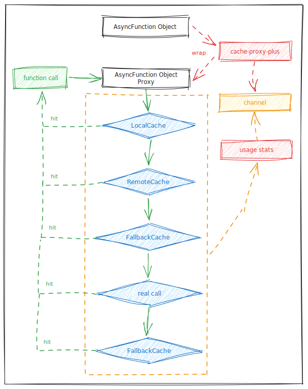

# Cache Proxy Plus   

[English](./README.md) | [简体中文](./README_CN.md)

## Overview

A Node.js library for executing proxy methods with ease, combining local and remote caching, with usage statistics output and written in TypeScript.

## Features

1. Supports ES Module only, not compatible with commonjs
2. Method proxy supports AsyncFunction only
3. Avoids cache breakdown; when the cache expires, it won't concurrently send requests to the backend service
4. Supports background polling updates to ensure the cache is always valid and up-to-date
5. Supports fallback cache, even if the remote service crashes and the cache has expired, it can still retrieve cached content
6. Supports remote cache, such as Redis
7. Supports caching usage statistics

## Cache Priority

In-process cache (local cache) --> Remote cache --> Fallback priority cache --> Actual call --> Fallback cache

As shown in the diagram:



## Usage Guide

### Install Dependencies

```vim
npm i cache-proxy-plus
// or
pnpm add cache-proxy-plus
```

### Basic Usage

```js
import { cacheProxyPlus } from 'cache-proxy-plus'

class Base {
  async doBase(id) {
    const res = Math.random(id)
    return res
  }
}

class Manager extends Base {
  async doJob(id) {
    const res = Math.random()
    return res
  }
}

const manager = new Manager()
const managerProxy = cacheProxyPlus(manager, { ttl: 2000, statsInterval: 1000 * 10 })
managerProxy.channel.on('stats', s => console.info(s))

setInterval(async () => {
  const res1 = await managerProxy.doJob(1)
  const res2 = await managerProxy.doJob(2)
  const res3 = await managerProxy.doBase(3)
}, 1000)
```

When importing, you can also use `cacheProxy` instead of `cacheProxyPlus`.

### Parameter

```js
cacheProxyPlus(target, options)
```

`target`:

- Class object containing `AsyncFunction`

`options`:

- `exclude`: _(default: `[]`)_ Exclude methods that do not require caching proxies, string array
- `ttl`: _(default: `1000 * 60`)_ Expiration time of the cache in milliseconds
- `checkPeriod`: _(default: `1000`)_ Time interval to check cache expiration in milliseconds
- `statsInterval`: _(default: `1000 * 60`)_ Interval for printing cache usage statistics in milliseconds
- `randomTtl`: _(default: `false`)_ Whether to add random timeout; calculated as: `ttl * (0.8 + 0.3 * Math.random())`
- `methodTtls`: _(default: `null`)_ Configure timeout for specific methods, as an `Object`.
  - [`methodName`]: _(default: `1000 * 60`)_ Cache expiration time for a specific method in milliseconds
- `subject`: _(default: `[target.constructor.name]`)_ Subject used as key prefix to differentiate keys for the same method of different targets.
  - Note: Cannot be a random string, or the key will be different after restarting
- `fallback`: _(default: `false`)_ Whether to use fallback cache; the fallback cache will save the last successfully retrieved value. When both local and asyncCache are invalid, and a real call fails, it retrieves the value from the fallback cache.
- `fallbackTtl`: _(default: `1000 * 60 * 60`)_ Expiration time of the fallback cache in milliseconds
- `fallbackMax`: _(default: `1000 * 10`)_ Maximum number of keys the fallback cache can store, using LRU strategy
- `fallbackFirst`: _(default: `false`)_ Prioritize using fallback cache, asynchronously execute update, so it doesn't wait for the real update to complete.
- `bgUpdate`: _(default: `false`)_ Whether to support background polling updates of key values
- `bgUpdateDelay`: _(default: `100`)_ Waiting time between updating two keys in the background
- `bgUpdatePeriodDelay`: _(default: `1000 * 5`)_ After a round of background polling updates, how long to wait before the next round of updates
- `bgUpdateExpired`: _(default: `1000 * 60 * 60`)_ After how long a key has not been accessed, stop background updates for that key
- `concurrency`: _(default: `10`)_ Total concurrency limit for real requests, including all methods, to avoid excessive impact on the backend
- `remoteCache`: _(default: `null`)_ Asynchronous cache object, can implement the use of external caches such as Redis and memcached, must inherit the base class `RemoteCache`

### Remote Cache

Using remote cache requires inheriting the base class `RemoteCache`, relevant code: [`RemoteCache`](./src/RemoteCache.ts)

Below is an example using Redis as the remote cache:

```ts
import { RemoteCache } from 'cache-proxy-plus'

class RedisCache extends RemoteCache {
  private redis = new Redis()
  constructor() {
    super()
  }

  async set(key: string, value: any, ttl: number) {
    const wrapped = { value }
    return this.redis.set(key, JSON.stringify(wrapped), 'PX', ttl + 100)
  }

  async get(key: string) {
    const wrapped = await this.redis.get(key)
    return wrapped ? JSON.parse(wrapped).value : null
  }

  quit() {
    this.redis.disconnect()
    this.redis.quit()
  }
}
```

### Event

```
managerProxy.channel.on('eventName', () => {})
```

`eventName` can be: `stats`, `bg.stats`, `bg.break.off`, `error`, and `expired`

#### Error

```js
managerProxy.channel.on('error', err => {
  // background error
})
```

#### Expired Key

```js
managerProxy.channel.on('expired', (key, type) => {
  // type: expired or fallbackExpired
})
```

#### Usage Statistics

`stats` contains `current`, `total`, and `methods`

```js
// Default output every minute
managerProxy.channel.on('stats', stats => {
  const {
    current, // Statistics for the last minute
    total, // Total statistics since the process started
    methods // Individual statistics for each method
  } = stats
  // ...
})
```

Details for each statistic:

```js
{
  local: 0, // Number of hits in local cache
  remote: 0, // Number of hits in remote cache
  update: 0, // Number of actual requests made
  miss: 0, // Number of cache misses
  expired: 0, // Number of local cache expirations
  failed: 0, // Number of request errors
  wait: 0, // Number of successful concurrent waits
  failedWait: 0, // Number of errors in concurrent waits
  background: 0, // Number of background updates
  failedBackground: 0, // Number of errors in background updates
  fallback: 0, // Number of hits in fallback cache
  fallbackFirst: 0, // Number of hits prioritizing fallback cache
  fallbackExpired: 0, // Number of fallback cache expirations
}
```

### Background

#### Update Statistics

```js
managerProxy.channel.on('bg.stats', stats => {
  // stats details
  // stats.cycleTime: Time for a complete update cycle
  // stats.delayTime: Pause time for a complete update cycle
  // stats.updateTime: Asynchronous waiting time for a complete update cycle
  // stats.updatedSize: Total number of keys updated in a complete update cycle
})
```

#### Keys Removed Due to Long Inactivity

```js
managerProxy.channel.on('bg.break.off', key => {
  // ...
})
```

## License

Released under the MIT License.
