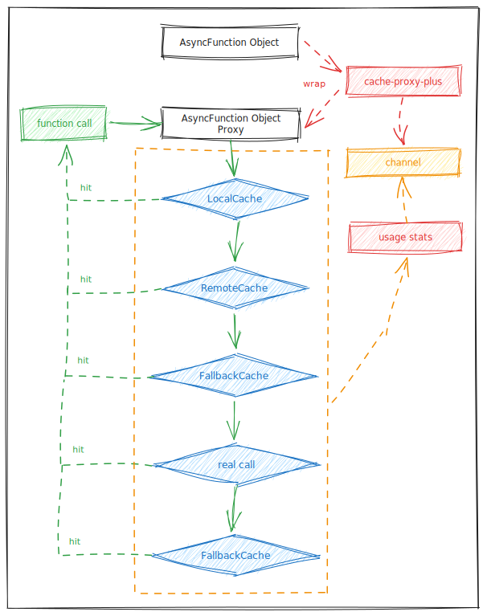

# Cache Proxy Plus   

[English](./README.md) | [简体中文](./README_CN.md)

## 概述

这是一个轻松结合本地和远程缓存的方法执行代理库，带使用统计输出，使用 TS 编写。

## 特性

1. 仅支持 ES Module，不支持 commonjs
2. 使用 TypeScript 编写，使用 Jest 测试
3. 方法代理仅支持 AsyncFunction
4. 避免并发击穿，缓存失效时，不会并发地向后端服务发起请求
5. 支持后台轮询更新，保证缓存一直有效并且是最新的
6. 支持后备缓存，即使远程服务崩溃并且缓存已过期，也能获取缓存内容
7. 支持远程缓存，如 Redis
8. 支持缓存使用情况统计

## 缓存优先级

进程内缓存(local cache) --> 远程缓存服务(remote cache) --> 后备优先缓存(fallback cache) --> 真实调用(real call) --> 后备缓存(fallback Cache)

如图所示：



## 使用教程

### 安装依赖

```vim
npm i cache-proxy-plus
// or
pnpm add cache-proxy-plus
```

### 基础用法

```js
import { cacheProxyPlus } from 'cache-proxy-plus'

class Base {
  async doBase(id) {
    const res = Math.random(id)
    return res
  }
}

class Manager extends Base {
  async doJob(id) {
    const res = Math.random()
    return res
  }
}

const manager = new Manager()
const managerProxy = cacheProxyPlus(manager, { ttl: 2000, statsInterval: 1000 * 10 })
managerProxy.channel.on('stats', s => console.info(s))

let i = 0
setInterval(async () => {
  i++
  const res1 = await managerProxy.doJob(i)
  const res2 = await managerProxy.doJob(i)
  const res3 = await managerProxy.doBase(i)
}, 1000)
```

引入方法时，也可以使用`cacheProxy`，代替`cacheProxyPlus`。

### 参数说明

```js
cacheProxyPlus(target, options)
```

`target`:

- 包含有`AsyncFunction`的`class`对象

`options`:

- `ttl`: _(默认值: `1000 * 60`)_ 缓存的过期时间，单位 ms
- `checkPeriod`: _(默认值: `1000`)_ 检查缓存过期的时间间隔，单位 ms
- `statsInterval`: _(默认值: `1000 * 60`_\* 缓存使用统计打印间隔，单位 ms
- `randomTtl`: _(默认值: `false`)_ 是否添加随机超时？计算公式为：`ttl * (0.8 + 0.3 * Math.random())`
- `methodTtls`: _(默认值: `null`)_ 对某些方法单独配置超时时间，是`Object`.
  - [`方法名`]: _(默认值: `1000 * 60`)_ 特定方法名的缓存过期时间，单位 ms
- `subject`: _(默认值: `[target.constructor.name]`)_ 主题，用作 key 前缀，区分不同 target 相同 method 的 key.
  - 注意：不能是随机字符串，否则重启后 key 就不一样了
- `fallback`: _(默认值: `false`)_ 是否使用后备缓存，后备缓存将保存上一次成功获取的值。在本地和asyncCache都失效的时候，同时还遭遇真实调用获取失败后，从后备缓存获取值。
- `fallbackTtl`: _(默认值: `1000 * 60 * 60`)_ 后备缓存的过期时间，单位ms
- `fallbackMax`: _(默认值: `1000 * 10`)_ 后备缓存的最多能够保存的key数量，使用LRU策略
- `fallbackFirst`: _(默认值: `false`)_ 优先使用后备缓存，异步执行update，这样可以不用等到真正的update执行完毕。
- `bgUpdate`: _(默认值: `false`)_ 是否支持后台轮询地更新key的值
- `bgUpdateDelay`: _(默认值: `100`)_ 后台轮询地更新两个key直接的等待时间
- `bgUpdatePeriodDelay`: _(默认值: `1000 * 5`)_ 后台轮询更新一轮后，等待多久才执行下一轮更新
- `bgUpdateExpired`: _(默认值: `1000 * 60 * 60`)_ 一个key多久没访问后，会把停止对该key继续后台更新
- `concurrency`: _(默认值: `10`)_ 真实请求的总并发限制，包括所有method，避免对后端有过大冲击
- `remoteCache`: _(默认值: `null`)_ 异步缓存对象，可以实现使用 redis 和 memcached 等外部缓存，要继承基类 `RemoteCache`

### 远程缓存

使用远程缓存需要继承`RemoteCache`基础类，相关代码: [`RemoteCache`](./src/RemoteCache.ts)

下面是使用 Redis 作为远程缓存的例子:

```ts
import { RemoteCache } from 'cache-proxy-plus'

class RedisCache extends RemoteCache {
  private redis = new Redis()
  constructor() {
    super()
  }

  async set(key: string, value: any, ttl: number) {
    const wrapped = { value }
    return this.redis.set(key, JSON.stringify(wrapped), 'PX', ttl + 100)
  }

  async get(key: string) {
    const wrapped = await this.redis.get(key)
    return wrapped ? JSON.parse(wrapped).value : null
  }

  quit() {
    this.redis.disconnect()
    this.redis.quit()
  }
}
```

### 事件监听

```
managerProxy.channel.on('eventName', () => {})
```

`eventName` 有：`stats`, `bg.stats`,`bg.break.off`,`error` 和 `expired`

#### 监听错误

```js
managerProxy.channel.on('error', err => {
  // background error
})
```

### 监听过期 key

```js
managerProxy.channel.on('expired', (key, type) => {
  // type: expired or fallbackExpired
})
```

#### 命中情况统计

`stats` 包含有 `current`、`total`和`methods`

```js
// 默认每分钟输出一次
managerProxy.channel.on('stats', stats => {
  const {
    current, // 最近一分钟的统计
    total, // 进程启动以来的总统计
    methods // 每个方法单独统计
  } = stats
  // ...
})
```

每个统计的详情如下：

```js
{
  local: 0, // 命中本地缓存次数
  remote: 0, // 命中远程缓存次数
  update: 0, // 真正发起请求数量
  miss: 0, // 缓存没命中数量
  expired: 0, // 本地缓存过期数量
  failed: 0, // 请求错误次数
  wait: 0, // 并发等待成功次数
  failedWait: 0, // 并发等待的错误次数
  background: 0, // 后台更新次数
  failedBackground: 0, // 后台更新错误次数
  fallback: 0, // 后备缓存命中次数
  fallbackFirst: 0, // 优先后备缓存命中次数
  fallbackExpired: 0, // 后备缓存过期数量
}
```

### 后台轮询

#### 更新统计

```js
managerProxy.channel.on('bg.stats', stats => {
  // stats 详情
  // stats.cycleTime: 一个完整更新周期的时间
  // stats.delayTime: 一个完整更新周期的暂停时间
  // stats.updateTime: 一个完整更新周期的异步等待时间
  // stats.updatedSize: 一个完整更新周期的总共更新了多少个key
})
```

#### 长时间没被使用而移除的key

```js
managerProxy.channel.on('bg.break.off', key => {
  // ...
})
```

## License

Released under the MIT License.
